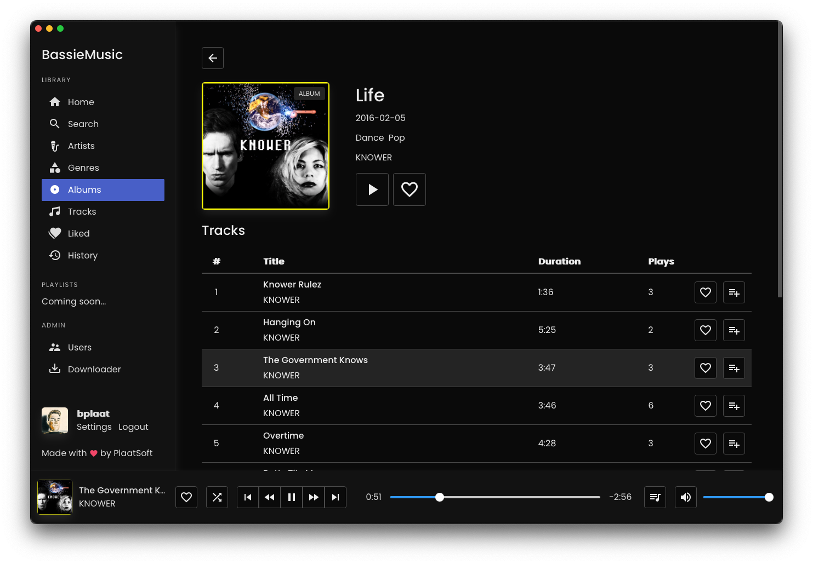

# BassieMusic

 

    An online music streaming platform wich can be run locally. That has a nice web music player. It can download new music with metadata from the Deezer API and YouTube music videos.

 

## Features
- Local online music streaming platform
- Nice music web player build with [SvelteKit](https://kit.svelte.dev/)
- Search your music library
- Arists, albums, tracks likes
- Play history and changeable music queue
- User made shareable playlists
- Automatic downloader with metadata from [Deezer](https://www.deezer.com/) and [YouTube](https://www.youtube.com/)
- Native macOS webview app
- Native Windows webview app
- Mobile player app build with [Flutter](https://flutter.dev/) and native code

Right now BassieMusic is in active developement, you can track the progress at our [Issue Board](https://github.com/users/bplaat/projects/1)

## Platforms
The BassieMusic player runs a lot of different platforms:
- [Web](web/): This is the main music player and library management tool
- [macOS](apps/macos/): This native macOS app runs the web player in a `WKWebview` with nice inset window controls
- [Windows](apps/windows/): This native Windows app runs the web player in a `Webview2` with nice custom window controls
- [Linux](apps/linux/): This basic GTK app runs the web player in a `Webkit2GTK` widget
- [Android & iOS (Flutter)](apps/flutter/): This mobile flutter player app is in development

## Screenshot

<i>
The BassieMusic <a href="/apps/macos/">macOS app</a> playing the album <a href="https://www.youtube.com/watch?v=dQY-wxW4nCo&list=PL6ZA--5Rknp2BXi1m5fq6d6zn1b8z3_kb">Life</a> from <a href="https://www.youtube.com/channel/UCaEKhXcW7dY65JoQB6fGhxg">Knower</a>
</i>

## Documentation
Some parts of the system are not well documented at this time, but we are working to improve this
- [Installation documentation](docs/installation.md)
- [REST API documentation](https://bassiemusic.plaatsoft.nl/api.html)
- [Issue Board](https://github.com/users/bplaat/projects/1)

## License
Copyright © 2022 - 2023 [PlaatSoft](https://www.plaatsoft.nl/)

Licensed under the [MIT](LICENSE) license.
